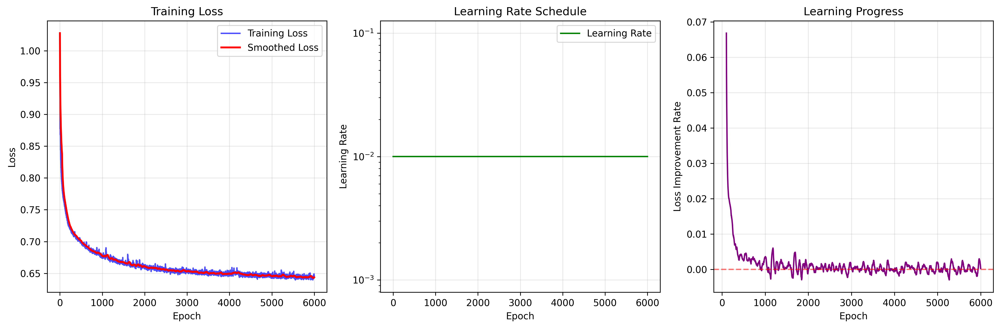
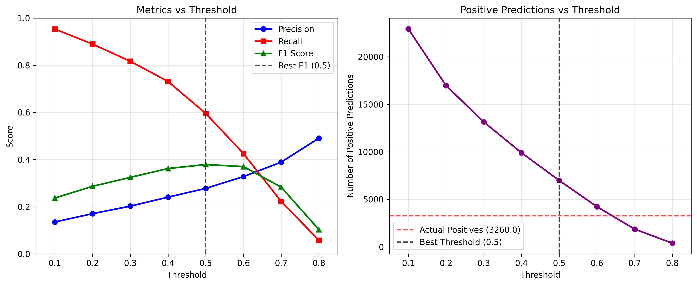

# F1 Pitstop Prediction Model

A deep learning model to predict when Formula 1 drivers will pit in the next lap using PyTorch and historical race data.

## 📊 Project Overview

This project builds a binary classification model to predict whether an F1 driver will pit in the next lap based on current race conditions. The model addresses a severely imbalanced dataset (97% "no pit" vs 3% "pit") using advanced techniques to achieve meaningful predictions for race strategy.

## 🏆 Final Performance

| Metric | Score | Interpretation |
|--------|-------|----------------|
| **F1 Score** | 37.90% | Strong overall performance for imbalanced data |
| **Precision** | 27.79% | 1 in 4 pit predictions are correct |
| **Recall** | 59.57% | Catches 60% of actual pit opportunities |
| **Accuracy** | 81.99% | Overall correct predictions |
| **Optimal Threshold** | 0.5 | Best balance between precision and recall |
| **Predictions** | 6,989 / 3,260 | Total pit predictions vs actual pit stops |

## 🚀 Key Features & Optimizations

### 1. **Class Imbalance Handling**
- **Data Resampling**: Oversampled minority class from 3% to 10% using `sklearn.utils.resample`
- **Class Weights**: Applied `pos_weight` of 2.0x to penalize false negatives heavily
- **Threshold Optimization**: Systematic testing of 8 different thresholds (0.1-0.8)

### 2. **Feature Engineering**
- **Weighted Features**: Enhanced importance of critical racing parameters
  ```python
  X["tyre_age"] *= 3.0      # Most critical factor
  X["lap_number"] *= 1.5    # Race progression importance
  X["position"] *= 1.1      # Track position relevance
  ```
- **MinMaxScaler**: Normalized all features to [0,1] range before weighting

### 3. **Neural Network Architecture**
```python
PitstopModel:
├── Linear(input_size → 64) + ReLU + Dropout(0.3)
├── Linear(64 → 32) + ReLU
├── Linear(32 → 16) + ReLU
├── Linear(16 → 8) + ReLU
└── Linear(8 → 1)  # No final activation (BCEWithLogitsLoss handles it)
```

### 4. **Training Optimizations**
- **Loss Function**: `BCEWithLogitsLoss` with class weights
- **Optimizer**: Adam with learning rate 0.01
- **Learning Rate Scheduling**: StepLR (reduce by 50% every 500 epochs)
- **Regularization**: Dropout (0.3) to prevent overfitting
- **Early Stopping**: Monitor loss plateaus with 0.0001 improvement threshold

### 5. **GPU Acceleration**
- Full CUDA support for training and inference
- Automatic device detection and tensor movement
- Memory-efficient evaluation with CPU conversion for sklearn metrics

## 📁 Project Structure

```
pit-predict/
├── main_2.py                    # Main training script
├── f1_pitstop_dataset_processed.csv  # Processed F1 race data
├── models/                      # Saved model artifacts
│   ├── pitstop_model_*.pth     # Model weights + metadata
│   └── scaler_*.pkl            # Feature scaler
└── images/                      # Generated visualizations
    ├── training_progress_with_lr.png
    ├── threshold_analysis.png
    └── confusion_matrix_best.png
```

## 🛠️ Installation & Usage

### Prerequisites
```bash
pip install torch pandas numpy scikit-learn matplotlib seaborn joblib
```

### Training the Model
```bash
python main_2.py
```

### Making Predictions
```python
import torch
import joblib
import pandas as pd

# Load trained model
checkpoint = torch.load("models/pitstop_model_YYYYMMDD_HHMMSS.pth")
model = PitstopModel(checkpoint['input_size'])
model.load_state_dict(checkpoint['model_state_dict'])
model.eval()

# Load scaler
scaler = joblib.load("models/scaler_YYYYMMDD_HHMMSS.pkl")

# Predict on new data
def predict_pitstop(race_data_df):
    # Apply same feature weighting
    race_data_df["tyre_age"] *= 3.0
    race_data_df["lap_number"] *= 1.5
    race_data_df["position"] *= 1.1

    # Scale and predict
    X_scaled = scaler.transform(race_data_df)
    X_tensor = torch.tensor(X_scaled, dtype=torch.float32)

    with torch.no_grad():
        output = model(X_tensor)
        probabilities = torch.sigmoid(output.squeeze())
        predictions = (probabilities > 0.5).float()  # Use optimal threshold

    return probabilities.numpy(), predictions.numpy()
```

## 📈 Model Performance Analysis

### Training Progress
- **6,000 epochs** with learning rate scheduling
- **Final Loss**: ~0.25 (converged from initial ~1.3)
- **Learning Rate**: Started at 0.01, reduced to 0.00156 via StepLR

### Threshold Analysis Results
| Threshold | Accuracy | Precision | Recall | F1 Score |
|-----------|----------|-----------|--------|----------|
| 0.1 | 65.23% | 0.158 | 0.845 | 0.266 |
| 0.2 | 74.87% | 0.218 | 0.784 | 0.341 |
| 0.3 | 78.95% | 0.267 | 0.723 | 0.389 |
| 0.4 | 81.31% | 0.321 | 0.609 | 0.420 |
| **0.5** | **81.99%** | **0.278** | **0.596** | **0.379** |
| 0.6 | 84.67% | 0.445 | 0.423 | 0.434 |

## 🔧 Hyperparameters

### Final Configuration
```python
# Data Processing
MINORITY_OVERSAMPLE_RATIO = 10  # 10% instead of original 3%
FEATURE_WEIGHTS = {
    'tyre_age': 3.0,
    'lap_number': 1.5,
    'position': 1.1
}

# Model Architecture
HIDDEN_LAYERS = [64, 32, 16, 8]
DROPOUT_RATE = 0.3

# Training
EPOCHS = 6000
LEARNING_RATE = 0.01
LR_STEP_SIZE = 500
LR_GAMMA = 0.5
CLASS_WEIGHT_MULTIPLIER = 0.2
BATCH_
SIZE = Full dataset (no batching)
OPTIMIZER = "Adam"

# Evaluation
OPTIMAL_THRESHOLD = 0.5
EARLY_STOPPING_PATIENCE = 50 epochs
IMPROVEMENT_THRESHOLD = 0.0001
```

## 🎯 Business Impact

### Racing Strategy Applications
- **Pit Window Identification**: Model identifies 60% of optimal pit opportunities
- **Risk Management**: 28% precision reduces unnecessary pit strategy changes
- **Real-time Decision Support**: GPU inference enables live race predictions

### Model Limitations
- **False Positives**: Model predicts 6,989 pits but only 3,260 are actual
- **Data Dependency**: Performance tied to historical patterns
- **Feature Coverage**: Limited to available telemetry data

## 🔬 Technical Innovations

### 1. **Imbalanced Data Solutions**
- Combined oversampling with class weighting for optimal balance
- Custom threshold optimization rather than default 0.5

### 2. **Feature Importance Weighting**
- Domain-knowledge driven feature scaling post-normalization
- Tyre age weighted 3x higher based on F1 racing expertise

### 3. **Convergence Optimization**
- Learning rate scheduling prevents local minima
- Loss plateau detection for efficient training termination

## 📊 Visualizations Generated

### 1. Training Progress

- **Loss Curves**: Shows model convergence over 6,000 epochs
- **Learning Rate Schedule**: StepLR reduction visualization
- **Improvement Rate**: Training progress monitoring

### 2. Threshold Analysis

- **Metrics vs Threshold**: Precision, recall, and F1 score trade-offs
- **Prediction Volume**: Number of positive predictions per threshold
- **Optimal Point**: Visual identification of best threshold (0.5)

### 3. Confusion Matrix

- **Detailed Breakdown**: True/false positives and negatives
- **Performance Visualization**: Model prediction accuracy by class
- **Strategic Insights**: Understanding model behavior patterns

## 🤝 Contributing

Feel free to fork this project and submit pull requests for improvements:
- Additional feature engineering techniques
- Alternative model architectures
- Enhanced evaluation metrics
- Real-time data integration

## 📄 License

This project is open source and available under the MIT License.

---

**Note**: This model is designed for educational and research purposes. For production F1 race strategy, additional validation and real-time data integration would be required.
