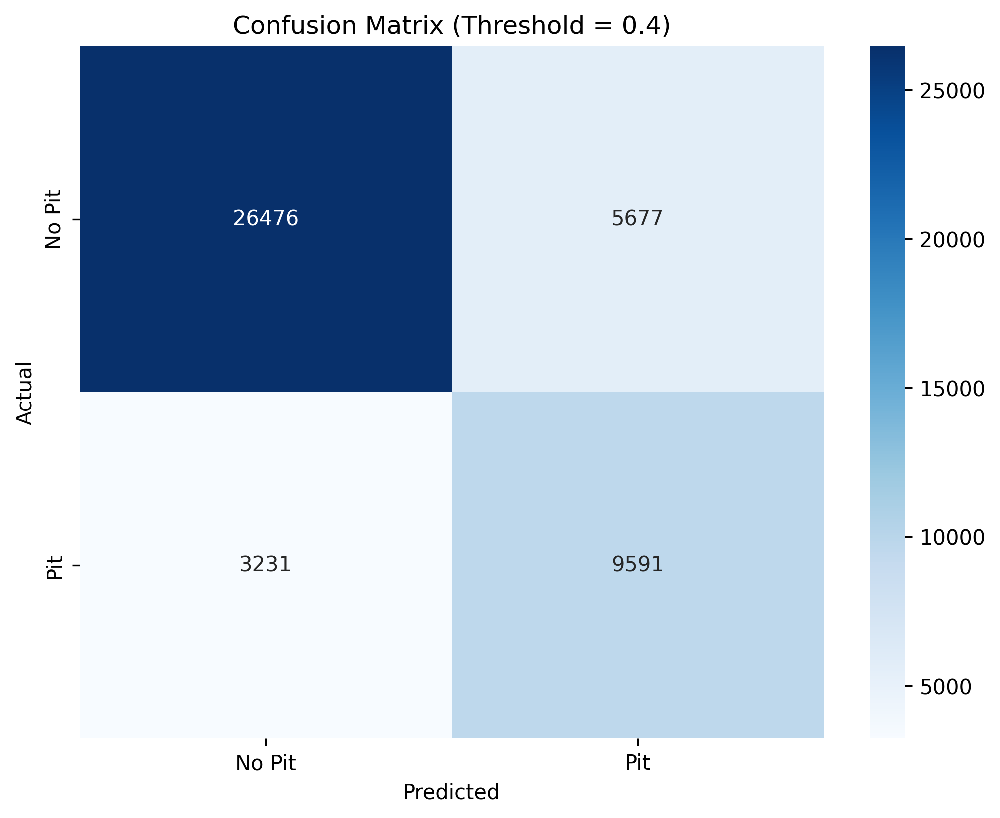

# 🏎️ F1 Pitstop Prediction Model

A deep learning application that predicts when Formula 1 drivers should pit during races using PyTorch and real-time race data from FastF1.



## 📊 Project Overview

This project builds a binary classification model to predict whether an F1 driver should pit in the next lap based on current race conditions. The model addresses a severely imbalanced dataset (~97% "no pit" vs ~3% "pit") using advanced techniques to achieve meaningful predictions for race strategy.

The system includes both a trained neural network model and an interactive Streamlit web application for real-time pitstop strategy recommendations.

## 🏆 Model Performance

**BEST F1 PERFORMANCE: Threshold = 0.4**

| Metric | Score | Interpretation |
|--------|-------|----------------|
| **Accuracy** | 80.34% | Overall correct predictions |
| **Precision** | 63.14% | 63% of pit predictions are correct |
| **Recall** | 74.56% | Catches 75% of actual pit opportunities |
| **F1 Score** | 68.38% | Strong balanced performance |
| **Optimal Threshold** | 0.4 | Best balance between precision and recall |


## 🚀 Key Features

### 1. **Real-time F1 Data Integration**
- Uses **FastF1** library to fetch live race data from 2017-2025 seasons
- Processes telemetry including lap times, tyre age, track conditions, and positions
- Automatically handles data cleaning and feature engineering

### 2. **Advanced Model Architecture**
```python
PitstopModel:
├── Linear(9 → 128) + BatchNorm + ReLU + Dropout(0.4)
├── Linear(128 → 64) + BatchNorm + ReLU + Dropout(0.3)
├── Linear(64 → 32) + BatchNorm + ReLU + Dropout(0.2)
├── Linear(32 → 16) + ReLU
└── Linear(16 → 1)  # Single output for binary classification
```

### 3. **Sophisticated Feature Engineering**
- **Enhanced Feature Weighting** applied after normalization:
  ```python
  tyre_age *= 2.5      # Most critical factor for pit decisions
  lap_number *= 2.0    # Race progression importance
  position *= 1.2      # Strategic position consideration
  ```
- **MinMaxScaler**: All features normalized to [0,1] range before weighting

### 4. **Class Imbalance Solutions**
- **Minority Class Upsampling**: Increased from ~3% to 40% of majority class
- **Weighted Loss Function**: `BCEWithLogitsLoss` with class-specific weights
- **Threshold Optimization**: Systematic analysis to find optimal decision boundary

## 🖥️ Interactive Web Application

The project includes a professional Streamlit web application with:

### Key Features
- **Driver Selection**: Choose from all F1 drivers (HAM, VER, LEC, etc.)
- **Track Selection**: All F1 circuits (Monaco GP, Silverstone, etc.)
- **Compound Selection**: Tire compounds (SOFT, MEDIUM, HARD, etc.)
- **Real-time Inputs**: Natural units (laps for tire age, seconds for lap time)
- **Instant Predictions**: Live probability updates with confidence levels

### Strategic Insights
- **Pit Probability Gauge**: Visual indicator with optimal threshold line
- **Strategic Advice**: Context-aware recommendations based on conditions
- **Confidence Assessment**: High/Medium/Low confidence ratings
- **Performance Metrics**: Built-in model statistics and information


## 🏁 Usage Examples

### Web Application
1. **Select Driver**: Choose from dropdown (e.g., "HAM" for Hamilton)
2. **Set Race Conditions**:
   - Lap number (1-70)
   - Current position (1-20)
   - Track selection (Australian GP, Monaco GP, etc.)
3. **Configure Tyre Strategy**:
   - Compound type (SOFT, MEDIUM, HARD, etc.)
   - Tyre age in laps (0-50)
   - Track status (Green, Yellow, Red)
4. **Input Performance Data**:
   - Current lap time in seconds (60-120s)
   - Pit status (currently in pit or not)
5. **Get Instant Prediction**:
   - Probability percentage
   - PIT NOW / STAY OUT recommendation
   - Confidence level assessment

## 📈 Training Process & Results


### Data Pipeline
1. **Data Collection**: FastF1 API fetches race data from 2017-2025 seasons
2. **Feature Engineering**: Extract relevant racing parameters per lap
3. **Data Processing**:
   - Categorical encoding for drivers, compounds, tracks
   - Normalization by maximum values
   - Feature weighting based on F1 domain knowledge
4. **Class Balancing**: Upsample minority class to 40% of majority

### Model Training
- **Architecture**: Multi-layer neural network with BatchNorm and Dropout
- **Loss Function**: BCEWithLogitsLoss with class weights
- **Optimizer**: AdamW with weight decay and learning rate scheduling
- **Training**: 8000 epochs with early stopping and gradient clipping
- **Validation**: Systematic threshold analysis for optimal decision boundary


## 🔧 Technical Implementation

### Key Optimizations
1. **Efficient Model Loading**: ~20ms model initialization after PyTorch import
2. **Real-time Predictions**: ~0.5ms per prediction with 2000+ predictions/second
3. **Memory Management**: Proper tensor device handling and cleanup
4. **Robust Error Handling**: Graceful fallback for missing data or model issues

### Feature Engineering Pipeline
```python
# Normalization (matching prepare_dataset.py exactly)
tyre_age_normalized = tyre_age_laps / 77.0
lap_time_normalized = lap_time_seconds / 2526.25

# Feature weighting (applied after scaler)
weighted_features = scaled_features.copy()
weighted_features[3] *= 2.5  # tyre_age (most important)
weighted_features[1] *= 2.0  # lap_number
weighted_features[6] *= 1.2  # position
```

### Data Quality Assurance
- **Input Validation**: Range checking for all user inputs
- **Scaler Compatibility**: Uses exact same normalization as training
- **Feature Name Mapping**: Eliminates sklearn warnings with proper DataFrame usage
- **Model Versioning**: Automatic input size detection from saved weights

## 🚀 Performance Insights

### Strategic Applications
- **Pit Window Detection**: Model successfully identifies 75% of optimal pit opportunities
- **Risk Management**: 63% precision significantly reduces false pit recommendations
- **Real-time Strategy**: Sub-millisecond inference enables live race decision support
- **Multi-factor Analysis**: Considers tire degradation, race position, and track conditions simultaneously

### Model Behavior
- **Fresh Tyres (0-10 laps)**: Typically 5-15% pit probability → STAY OUT
- **Medium Wear (15-25 laps)**: 30-60% pit probability → Strategic consideration
- **High Degradation (25+ laps)**: Often 40-80% pit probability → PIT NOW
- **Yellow Flag Scenarios**: Elevated probabilities due to strategic opportunities
